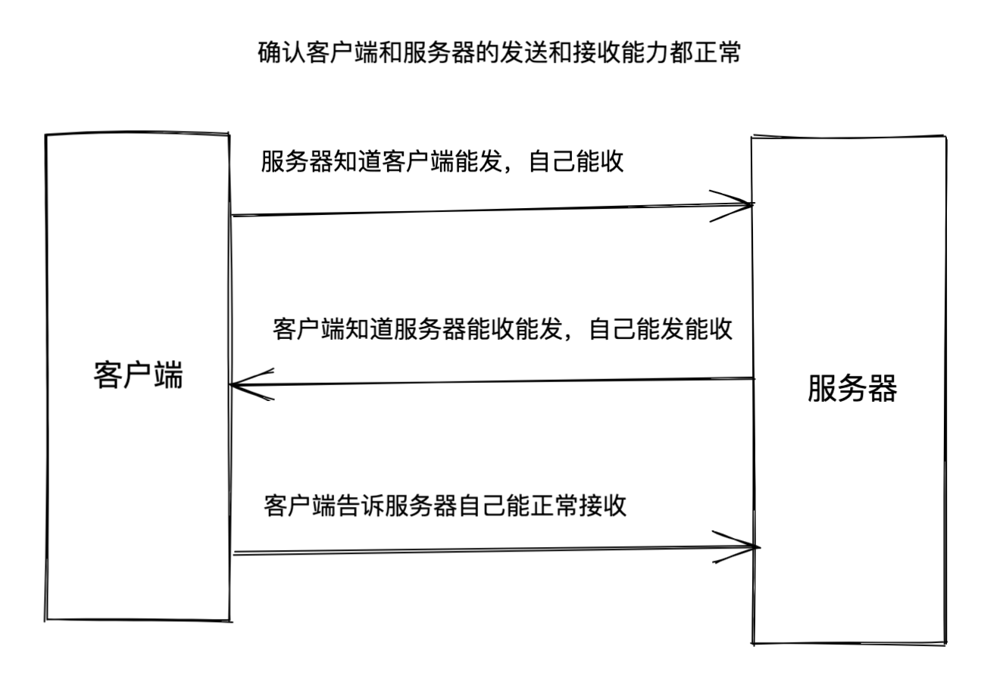

# 浏览器如何工作的

用户希望：应用页面快速加载，交互流畅。

Web 性能的两个主要问题是：

- 理解与延迟有关的问题
- 大多数情况下浏览器是单线程的事实有关的问题。

当用户请求网站或应用程序时，为了填充浏览器，有一系列步骤，包括 DNS 查找、TCP 握手和 SSL 协商. 然后浏览器解析接收到的内容，构建 DOM、CSSOM、可访问性和渲染树，最终渲染页面。

## 导航

导航是加载网页的第一步。每当用户通过在地址栏中输入 URL、单击链接、提交表单以及其他操作来请求页面时，它就会发生。

### DNS ，查询 IP 地址服务器

导航到网页的第一步是找到该页面的资产所在的位置。

DNS ：域名解析系统，通过网址查找到对应的 IP 地址服务器。

基本划分：根域名，顶级域名（cn,com）,二级...

基本步骤：

- 1 递归查询找浏览器缓存的
- 2 找操作系统 host
- 3 找本地域名服务器
- 4 迭代查询远程根域名服务器
- 5 查询顶级域名服务器
- 6 查询权威域名服务器
- 7 本地域名服务器缓存迭代查询的结果 IP 地址
- 8 操作系统缓存
- 9 浏览器缓存

### TCP 握手，确认服务器与客户端的收发能力

一旦知道 IP 地址，浏览器就会通过 TCP 三向握手建立与服务器的连接。

三次握手：通过三次握手，就能确定双方的接收和发送能力是正常的。

- 第一次握手：客户端发送网络包，服务端收到了 这样服务端就能得出结论：客户端的发送能力、服务端的接收能力是正常的。
- 第二次握手：服务端发包，客户端收到了 这样客户端就能得出结论：服务端的接收、发送能力，客户端的接收、发送能力是正常的。不过此时服务器并不能确认客户端的接收能力是否正常
- 第三次握手：客户端发包，服务端收到了。 这样服务端就能得出结论：客户端的接收、发送能力正常，服务器自己的发送、接收能力也正常

### TLS 协商，HTTPS 建立安全的连接

通过 HTTPS 建立的安全连接,确定将使用哪种密码来加密通信、验证服务器并在开始实际数据传输之前建立安全连接。

在实际发送内容请求之前，这需要与服务器进行三次以上的往返。

## 请求和响应

一旦我们与 Web 服务器建立了连接，浏览器就会代表用户发送一个初始 HTTPGET 请求，对于网站来说，这通常是一个 HTML 文件。

一旦服务器收到请求，它会回复相关的响应头和 HTML 的内容。

### TCP 慢启动/14KB 规则

第一个响应数据包将是 14KB。这是 TCP 慢启动的一部分，一种平衡网络连接速度的算法。慢启动逐渐增加传输的数据量，直到可以确定网络的最大带宽。

在 TCP 慢启动中，在收到初始数据包后，服务器将下一个数据包的大小加倍到 28KB 左右。后续数据包的大小会增加，直到达到预定阈值或出现拥塞。

如果您听说过初始页面加载的 14KB 规则，TCP 慢启动是初始响应为 14KB 的原因，也是 Web 性能优化要求针对初始 14KB 响应进行集中优化的原因。TCP 慢启动逐渐建立适合网络能力的传输速度以避免拥塞。

## 解析

一旦浏览器接收到第一块数据，它就可以开始解析接收到的信息。

解析是浏览器将其通过网络接收的数据转换为 DOM 和 CSSOM 的步骤，渲染器使用这些数据将页面绘制到屏幕上。

即使请求页面的 HTML 大于初始的 14KB 数据包，浏览器也会开始解析并尝试根据其拥有的数据呈现体验。这就是为什么在前 14 KB 中包含浏览器开始呈现页面所需的所有内容或至少包含页面模板（首次呈现所需的 CSS 和 HTML）对于 Web 性能优化很重要。但在将任何内容呈现到屏幕之前，必须解析 HTML、CSS 和 JavaScript。

## 渲染

### 构建 DOM 树

html 元素是文档树的第一个标记和根节点。DOM 节点的数量越多，构建 DOM 树所需的时间就越长。

当解析器找到非阻塞资源（例如图像）时，浏览器将请求这些资源并继续解析。

当遇到 CSS 文件时，解析可以继续。

当遇到 script 文件时，尤其是那些没有 async/defer 属性的标签会阻止渲染，并暂停 HTML 的解析。

尽管浏览器的预加载扫描器加快了这个过程，但过多的脚本仍然是一个重要的瓶颈。

### 构建 CSSOM 树

关键渲染路径的第二步是处理 CSS 和构建 CSSOM 树。

构建 CSSOM 非常非常快。

在当前的开发人员工具中不会以独特的颜色显示。相反，开发人员工具中的“重新计算样式”显示了解析 CSS、构建 CSSOM 树和递归计算计算样式所花费的总时间。

在 Web 性能优化方面，有更容易实现的成果，因为创建 CSSOM 的总时间通常少于一次 DNS 查找所需的时间。

### 组合 DOM 和 CSSOM 成渲染树

关键渲染路径的第三步是将 DOM 和 CSSOM 组合成渲染树。计算样式树或渲染树的构造从 DOM 树的根开始，遍历每个可见节点。

### 布局

关键渲染路径中的第四步是在渲染树上布局。

布局是**初始**确定渲染树中所有节点的**大小和位置**的过程。

重排是**后续**确定页面部分或整个文档的**大小和位置**的过程。

一旦构建了渲染树，布局就开始了。渲染树识别显示哪些节点（即使不可见）及其计算样式，但不识别每个节点的尺寸或位置。为了确定每个对象的确切大小和位置，浏览器从渲染树的根开始并遍历它。

布局一般从 body 开始，布局所有 body 的后代尺寸，每个元素的盒模型属性，为不知道尺寸的替换元素提供占位符空间，例如 image。

假设初始布局发生在返回图像之前。由于我们没有声明图像的大小，因此一旦知道图像大小就会进行重排（回流）。

### 绘画

关键渲染路径的最后一步是将各个节点用像素绘制到屏幕上。

绘画涉及将元素的每个视觉部分绘制到屏幕上，包括文本、颜色、边框、阴影和替换元素（如按钮和图像）。浏览器需要非常快速地完成这项工作。

为了确保流畅的滚动和动画，所有占用主线程的东西，包括计算样式，以及回流和绘制，都必须让浏览器在 16.67 毫秒内完成。

在 2048 X 1536 下，iPad 有超过 3,145,000 个像素要绘制到屏幕上。这是很多像素，必须非常快速地绘制。为了确保重绘可以比初始绘制更快地完成，屏幕上的绘图通常被分解成几层。如果发生这种情况，则需要进行合成。

绘画可以将布局树中的元素分解成层。

将内容提升到 GPU 上的层（而不是 CPU 上的主线程）可以提高绘制和重绘性能。

有一些特定的属性和元素可以实例化一个层，包括`<video>`和`<canvas>`，以及任何具有 CSS 属性 opacity3D transform、will-change 和其他一些元素的元素。这些节点将连同它们的后代一起绘制到它们自己的层上，除非后代出于上述一个（或多个）原因需要它自己的层。

层确实可以提高性能，但在内存管理方面代价高昂，因此不应将其过度用作 Web 性能优化策略的一部分。

#### 合成

当文档的各个部分绘制在不同的层中并相互重叠时，合成是必要的，以确保它们以正确的顺序绘制到屏幕上并且内容被正确呈现。

随着页面继续加载资产，可能会发生回流（回想一下我们迟到的示例图像）。回流会引发重绘和重新合成。如果我们定义了图像的大小，就不需要回流，只有需要重绘的图层才会被重绘，并在必要时进行合成。但是我们没有包括图像大小！从服务器获取图像后，渲染过程返回到布局步骤并从那里重新开始。

## 互动性

主线程完成页面绘制后，您会认为我们“一切就绪”。不一定是这样。如果加载包括正确延迟的 JavaScript，并且仅在 onload 事件触发后执行，则主线程可能很忙，无法用于滚动、触摸和其他交互。

交互时间(TTI) 衡量的是从导致 DNS 查找和 SSL 连接的第一个请求到页面交互时所用的时间——交互是在第一次内容绘制之后页面响应时的时间点 50 毫秒内的用户交互。如果主线程忙于解析、编译和执行 JavaScript，则它不可用，因此无法及时（小于 50 毫秒）响应用户交互。

## 参考文档

[MDN 浏览器如何工作的](https://developer.mozilla.org/en-US/docs/Web/Performance/How_browsers_work)
[MDN 浏览器渲染](https://developer.mozilla.org/en-US/docs/Web/Performance/Critical_rendering_path)
