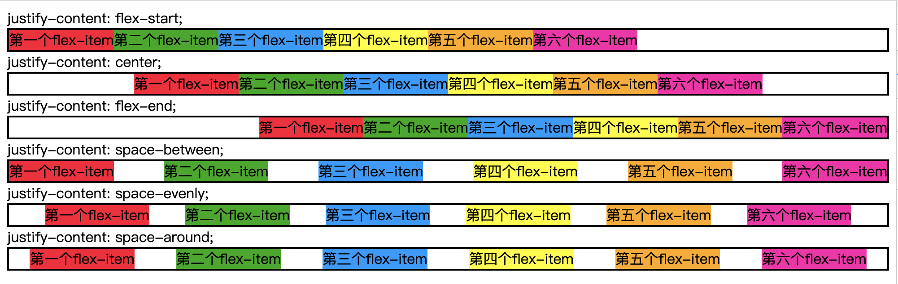
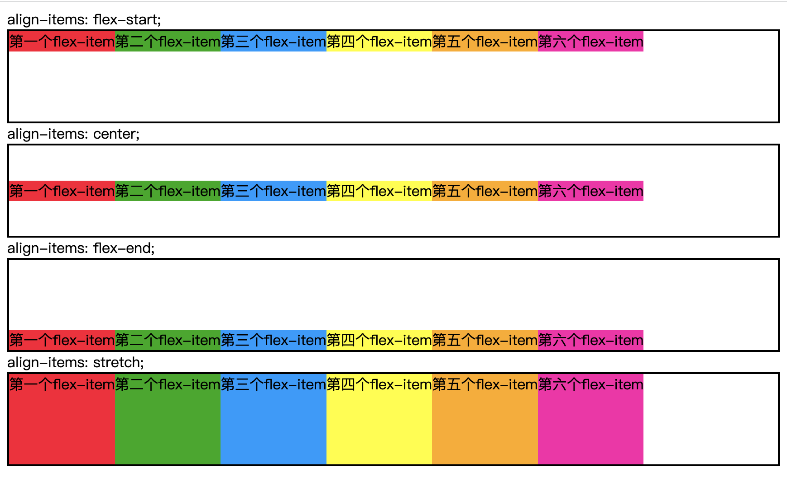

# Flex布局

flex 表示弹性盒子布局  
基本概念有：

- 主轴方向
- 起始线和结束线
- 容器盒子
  将容器 display 属性的值设置为 flex 或 inline-flex。一旦我们这样做了，那个容器的直接子元素就变成了 flex items。
- 可用空间
  改变可用空间在我们的项目之间的分配方式

## flex-direction

主轴方向

```css
.container {
  flex-direction: row | row-reverse | column | column-reverse;
}
```

## flex-wrap

是否换行

```css
.container {
  flex-wrap: nowrap | wrap | wrap-reverse;
}
```

## flex-flow（简写）

flex-direction + flex-wrap

```css
.container {
  flex-flow: row nowrap;
}
```

## justify-content

项目在主轴上的对齐方式

效果：



```css
.container {
  justify-content: flex-start | flex-end | center | space-between | space-around;
}
```

## align-items

项目在交叉轴上的对齐方式

效果：



```css
.container {
  align-items: flex-start | flex-end | center | stretch;
}
```

## flex-basis

项目基本尺寸，在 flex-grow 和 flex-shrink 生效前的尺寸 , 默认值为 auto，即项目的本来大小，如设置了 width 则元素尺寸由 width/height 决定（主轴方向），没有设置则由内容决定

```css
.item {
  flex-basis: auto | <length>; /* default auto */
}
```

## flex-grow

定义项目的放大比例（容器宽度>元素总宽度时如何伸展,默认为 0，即如果存在剩余空间，也不放大

```css
.item {
  flex-grow: <number>; /* default 0 */
}
```

## flex-shrink

定义了项目的缩小比例（容器宽度<元素总宽度时如何收缩），默认为 1，即如果空间不足，该项目将缩小

```css
.item {
  flex-shrink: <number>; /* default 1 */
}
```

## flex (简写)

flex 属性是 flex-grow, flex-shrink 和 flex-basis 的简写，默认值为 0 1 auto

flex-basis:0 和 flex-basis:auto 的区别

当设置为 0 时（绝对弹性元素），此时相当于告诉 flex-grow 和 flex-shrink 在伸缩的时候不需要考虑我的尺寸

当设置为 auto 时（相对弹性元素），此时则需要在伸缩时将元素尺寸纳入考虑

```css
.item {
  flex: none | [ < "flex-grow" > < "flex-shrink" >? || < "flex-basis" > ];
}
```

## 参考文档

- [MDN 弹性盒的基本概念](https://developer.mozilla.org/en-US/docs/Web/CSS/CSS_Flexible_Box_Layout/Basic_Concepts_of_Flexbox)
