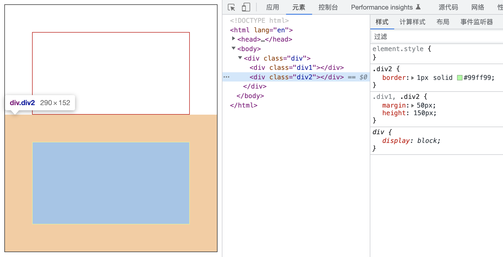
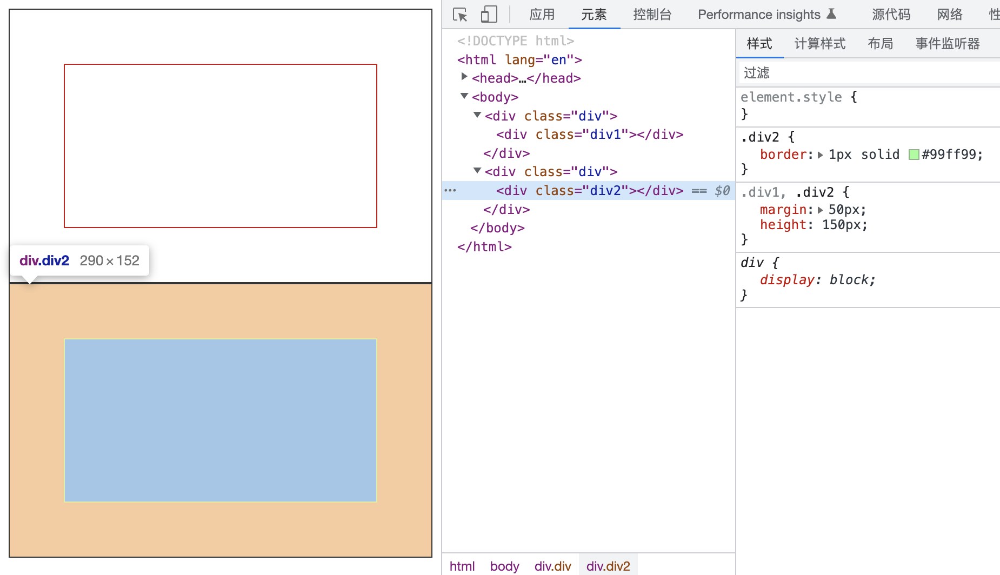
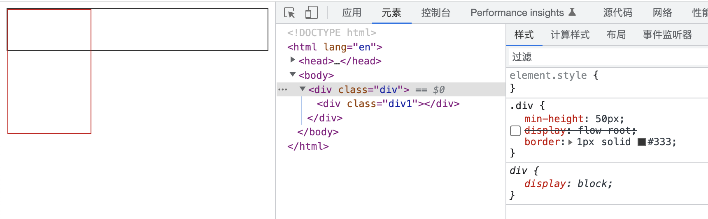
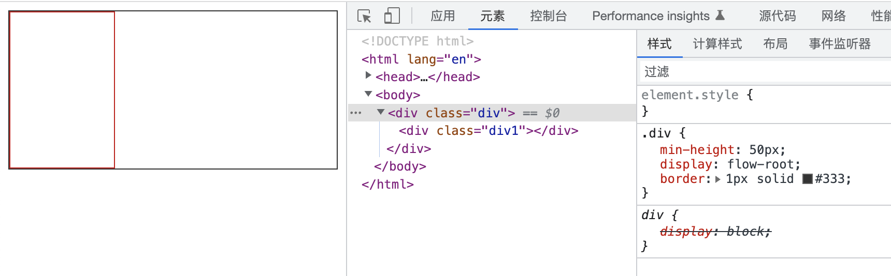
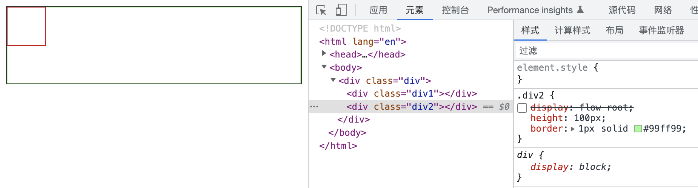
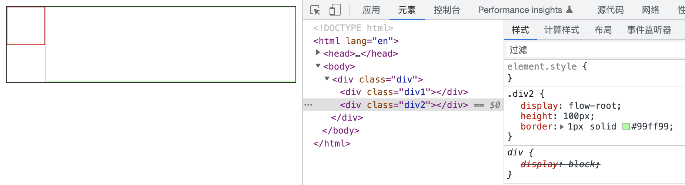
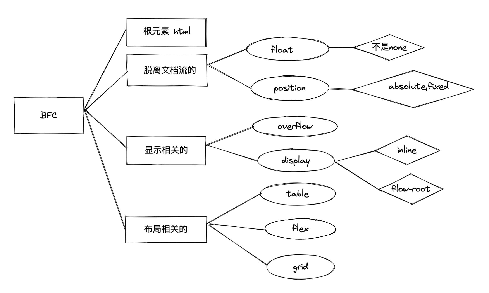

# BFC 的作用与触法

BFC 即块级格式化上下文，页面渲染的独立容器，有自己的渲染特性。

CSS 中有的一些 formart context:
block context
inline context
flex context
grid context

## BFC 的应用

- **相邻两个 BFC 内的元素 margin 不会重叠**  
  日常解决 margin 塌陷问题的方法，就是 margin 外面再套一层
  
  
- **清除内部浮动**
  
  
  相比常用的 clear:both,不需要添加额外的标签或者找最后一个标签
- **清除外部浮动（这个最有用）**
  
  
  之前创建自适应多烂布局是直接 div2 加 margin-left 实现，不够灵活

## BFC 的特性

这个直接记应用更实际，能联想出特性。

## establish 条件

只例举最常见的：

- html
- float 不是 none
- position 是 absolute 或 fixed
- overflow 不是 visible
- display 是行内元素 inline-\* 或 flow-root
- table flex grid
  

## 参考文档

[MDN](https://developer.mozilla.org/zh-CN/docs/Web/Guide/CSS/Block_formatting_context)
