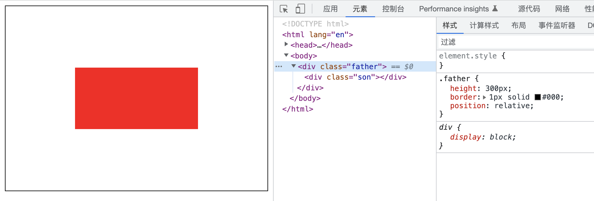
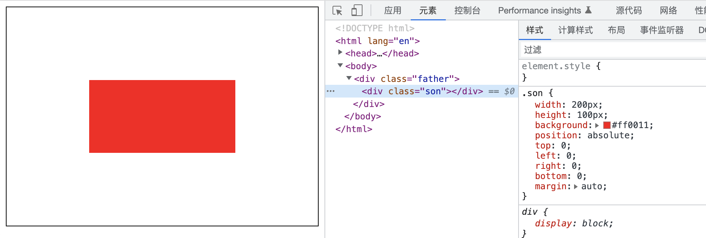
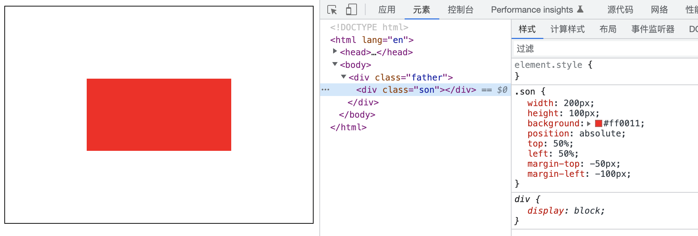
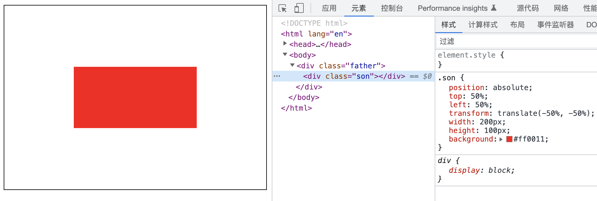
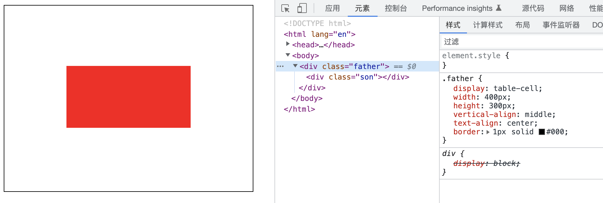
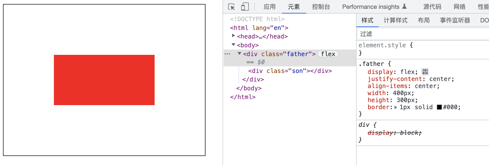
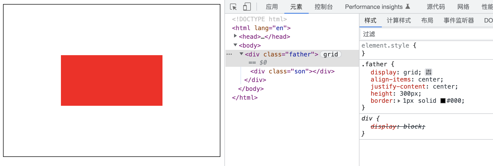

# CSS 中水平垂直居中

## 利用定位实现的水平垂直居中

### 方案一 父相子绝 设宽高 margin

效果：



要点：

- 父相子绝
- 父元素需设置 `height=*;`
- 子元素需设置 `width=* ; height=* ; margin: auto; top:0; right:0; bottom:0; left:0;`

缺点：

- 父元素需要设置高度
- 子元素需要设置宽度 高度

代码：

```css
.father {
  position: relative;
  height: 300px;
  border: 1px solid #000;
}
.son {
  position: absolute;
  top: 0;
  left: 0;
  right: 0;
  bottom: 0;
  margin: auto;
  width: 200px;
  height: 100px;
  background: #ff0011;
}
```

### 方案二 父相子绝 设宽高 margin

效果：


要点：

- 父相子绝
- 父元素需设置 `height=*;`
- 子元素需设置 `width=* ; height=* ; top: 50%;left: 50%;margin-top: 负值（子元素高度的一半）;margin-left: 负值（子元素宽度的一半）`

缺点：

- 父元素需要设置高度
- 子元素需要设置宽度 高度
- 子元素需要根据自身宽高计算 margin 的负值

代码：

```css
.father {
  position: relative;
  height: 300px;
  border: 1px solid #000;
}
.son {
  position: absolute;
  top: 50%;
  left: 50%;
  margin-top: -50px;
  margin-left: -100px;
  width: 200px;
  height: 100px;
  background: #ff0011;
}
```

### 方案三 父相子绝 设宽高 transform

效果：


要点：

- 父相子绝
- 父元素需设置 `height=*;`
- 子元素需设置 `width=* ; height=* ; top: 50%;left: 50%;transform: translate(-50%, -50%);`

缺点：

- 父元素需要设置高度
- 子元素需要设置宽度 高度

代码：

```css
.father {
  position: relative;
  height: 300px;
  border: 1px solid #000;
}
.son {
  position: absolute;
  top: 50%;
  left: 50%;
  transform: translate(-50%, -50%);
  width: 200px;
  height: 100px;
  background: #ff0011;
}
```

## 利用 table

效果：


要点：

- 父元素需设置 `width=* ;height=*;display: table-cell;vertical-align: middle;text-align: center;`
- 子元素需设置 `inline-block;`

缺点：

- 比较古老，一般不推荐，表格布局影响性能

代码：

```css
.father {
  display: table-cell;
  vertical-align: middle;
  text-align: center;
  width: 400px;
  height: 300px;
  border: 1px solid #000;
}
.son {
  display: inline-block;
  width: 200px;
  height: 100px;
  background: #ff0011;
}
```

## 利用 flex

效果：


要点：

- 父元素需设置 `display: flex;justify-content: center;align-items: center;`

代码：

```css
.father {
  display: flex;
  justify-content: center;
  align-items: center;
  height: 300px;
  border: 1px solid #000;
}
.son {
  width: 200px;
  height: 100px;
  background: #ff0011;
}
```

## 利用 grid

效果：


要点：

- 父元素需设置 `display: grid;justify-content: center;align-items: center;`

代码：

```css
.father {
  display: grid;
  justify-content: center;
  align-items: center;
  height: 300px;
  border: 1px solid #000;
}
.son {
  width: 200px;
  height: 100px;
  background: #ff0011;
}
```
