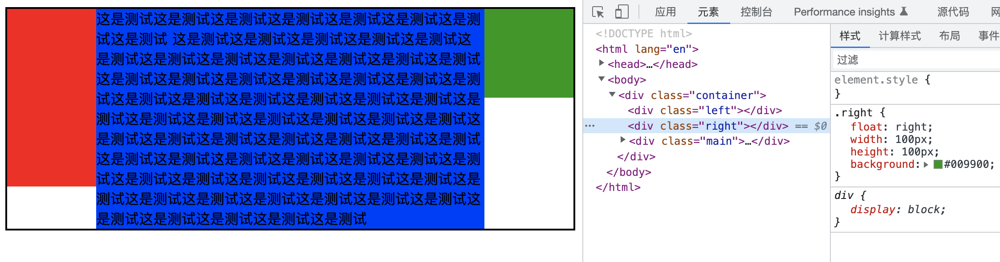
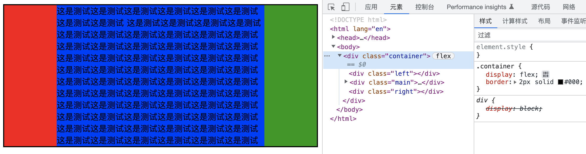
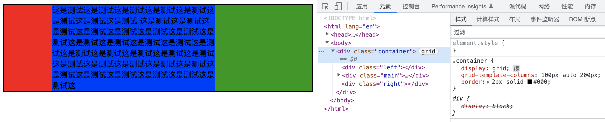

# N 栏自适应布局

## 两栏布局

左边定宽，右边自适应
仅例举简单常见的几种

### 利用左边浮动，右边 BFC

效果：

要点：

- 左边浮动 定宽
- 右边 BFC 默认宽度

代码：

```css
.container {
  border: 2px solid #000;
}
.left {
  float: left;
  width: 100px;
  height: 100px;
  background: #ff0011;
}
.main {
  overflow: auto;
  height: 200px;
  background: #0033ff;
}
```

### 利用 Flex

效果：

要点：

- 父容器 `display: flex;`
- 左边定宽
- 右边 `flex: 1;`

特别说明：
flex 容器默认属性值:`align-items: stretch`这个属性会有列等高的效果。如果不需要列等高，需要设置:`align-items: flex-start`

代码：

```css
.container {
  display: flex;
  border: 2px solid #000;
}
.left {
  width: 100px;
  background: #ff0011;
}
.main {
  flex: 1;
  background: #0033ff;
}
```

## 三栏布局

左右定宽，中间自适应  
仅例举简单常见的几种

### 利用左边右边浮动，main 创建 BFC

效果：

要点：

- 左边浮动定宽，右边浮动定宽
- main BFC 默认宽度

特别说明：
这种利用侧边浮动，结合主内容创建 BFC 清除外部浮动的形式，需注意 DOM 结构的顺序，一定需要浮动在前，BFC 在后。

代码：

```css
.container {
  border: 2px solid #000;
}
.left {
  float: left;
  width: 100px;
  height: 200px;
  background: #ff0011;
}
.right {
  float: right;
  width: 100px;
  height: 100px;
  background: #009900;
}
.main {
  overflow: auto;
  background: #0033ff;
}
```

```html
<div class="left"></div>
<div class="right"></div>
<div class="main">主内容</div>
```

### 利用 Flex

效果：

要点：

- 父容器 `display: flex;`
- 左边定宽，右边定宽
- 中间 `flex: 1;`

特别说明：
flex 容器默认属性值:`align-items: stretch`这个属性会有列等高的效果。如果不需要列等高，需要设置:`align-items: flex-start`
代码：

```css
.container {
  display: flex;
  border: 2px solid #000;
}
.left {
  width: 100px;
  background: #ff0011;
}
.right {
  width: 100px;
  background: #009900;
}
.main {
  flex: 1;
  background: #0033ff;
}
```

### 利用 grid

效果：

要点：

- 父容器 `display: grid;grid-template-columns: 100px auto 200px;`

代码：

```css
.container {
  display: grid;
  grid-template-columns: 100px auto 200px;
  border: 2px solid #000;
}
.left {
  background: #ff0011;
}
.right {
  background: #009900;
}
.main {
  background: #0033ff;
}
```
