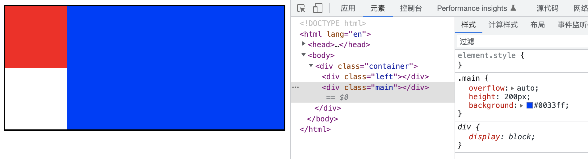
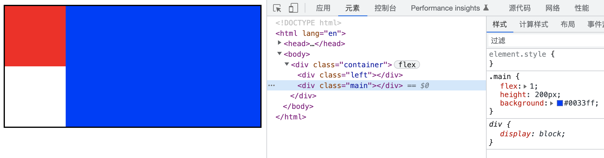
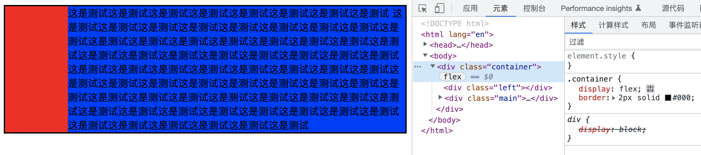

# N 栏自适应布局

## 两栏布局

左边定宽，右边自适应

### 利用左边浮动，右边 BFC

效果：

要点：

- 左边浮动 定宽
- 右边 BFC 默认宽度

代码：

```css
.container {
  border: 2px solid #000;
}
.left {
  float: left;
  width: 100px;
  height: 100px;
  background: #ff0011;
}
.main {
  overflow: auto;
  height: 200px;
  background: #0033ff;
}
```

### 利用 Flex

效果：

要点：

- 父容器 `display: flex;`
- 左边定宽
- 右边 `flex: 1;`

特别说明：
flex 容器默认属性值:`align-items: stretch`这个属性会有列等高的效果。如果不需要列等高，需要设置:`align-items: flex-start`

代码：

```css
.container {
  display: flex;
  border: 2px solid #000;
}
.left {
  width: 100px;
  background: #ff0011;
}
.main {
  flex: 1;
  background: #0033ff;
}
```

## 三栏布局

左右定宽，中间自适应
