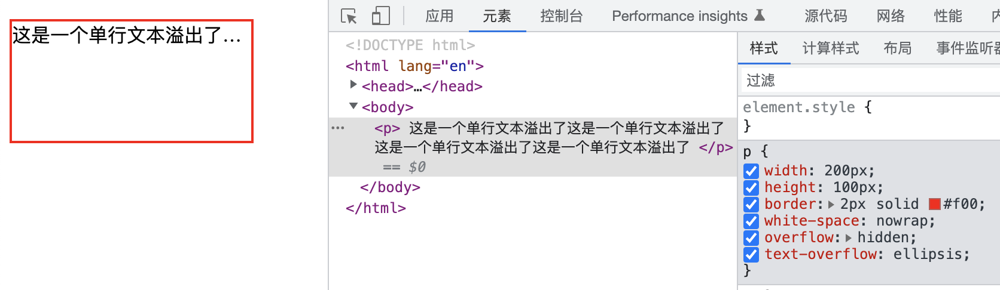
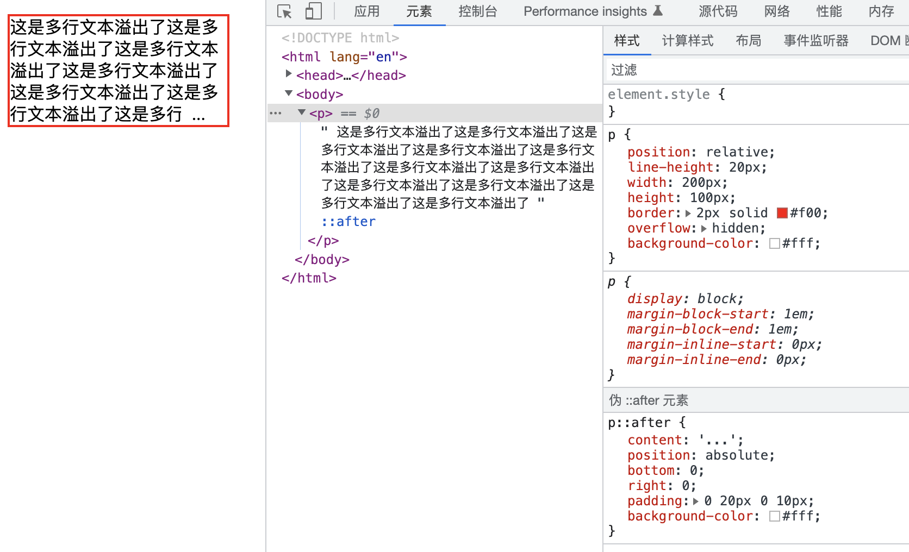
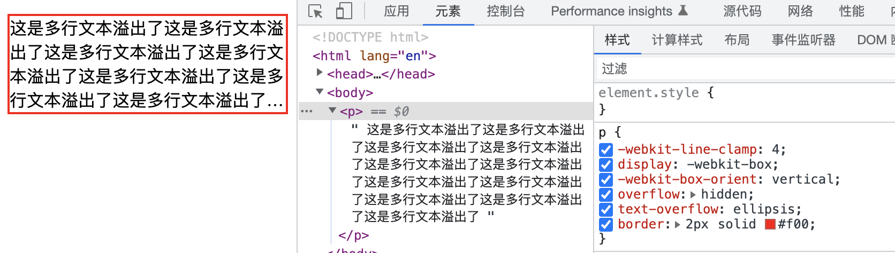

# 如何实现单行／多行文本溢出的省略样式？

## 单行文本

效果：



要点：

- `white-space:nowrap` 设置文字在一行显示，不能换行
- `overflow:hidden` 文字长度超出限定宽度，则隐藏超出的内容
- `text-overflow:ellipsis` 当对象内文本溢出时显示省略标记（...）

**text-overflow 只有在设置了 overflow:hidden 和 white-space:nowrap 才能够生效的**

代码：

```css
p {
  width: 200px;
  height: 100px;
  border: 2px solid #f00;
  white-space: nowrap;
  overflow: hidden;
  text-overflow: ellipsis;
}
```

## 多行文本

### 定高

效果：  


要点：

- 设置容器 `position: relative;`
  超出宽度部分隐藏 `overflow: hidden;`
- 设置伪元素`position: absolute;`

**这个方法思路在于用伪元素伪造的...遮盖容器文本，所以需设置容器与伪元素背景色一致，遮挡效果需要根据实际情况微调（比如至少不能显示半个汉字吧）**
一般文本存在英文的时候，可以设置 word-break: break-all 使一个单词能够在换行时进行拆分

#

代码：

```css
p {
  position: relative;
  height: 100px;
  border: 2px solid #f00;
  overflow: hidden;
  background-color: #fff;
}
p::after {
  content: "...";
  position: absolute;
  bottom: 0;
  right: 0;
  padding: 0 20px 0 10px;
  background-color: #fff;
}
```

### 定行数

效果：  


要点：

- `webkit-line-clamp: 2`用来限制在一个块元素显示的文本的行数，为了实现该效果，它需要组合其他的 WebKit 属性）
- `display: -webkit-box`和 1 结合使用，将对象作为弹性伸缩盒子模型显示
- `webkit-box-orient:vertical`和 1 结合使用 ，设置或检索伸缩盒对象的子元素的排列方式
- `overflow:hidden` 文字长度超出限定宽度，则隐藏超出的内容
- `text-overflow:ellipsis` 当对象内文本溢出时显示省略标记（...）

**-webkit-line-clamp: 4;display: -webkit-box;-webkit-box-orient: vertical; `需结合使用 。**
后两个已经是弃用属性了，但是浏览器还支持，目前也就用到这个地方。
需要注意的是，如果文本为一段很长的英文或者数字，则需要添加 word-wrap: break-word 属性

代码：

```css
p {
  -webkit-line-clamp: 4;
  display: -webkit-box;
  -webkit-box-orient: vertical;
  overflow: hidden;
  text-overflow: ellipsis;
  border: 2px solid #f00;
}
```
