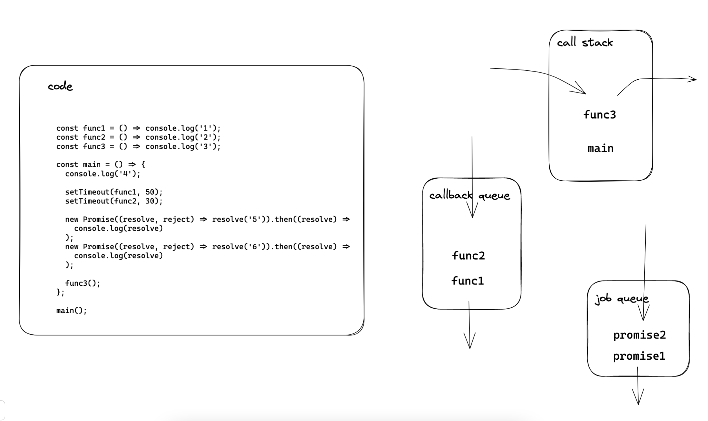

# 事件循环相关

## 相关术语

call stack : 执行栈。又叫 function execution stack。JS 引擎维护的一种栈数据结构（后进先出），用于追踪当前函数的执行。函数一旦开始运行就会被加入到执行栈中，执行完毕后，会被弹出。

callback queue: 回调队列。又叫 task queue，或者 macro task。JS 引擎维护的一种队列数据结构（先进先出），用于临时存储需要异步执行的函数。主要是 WebAPI BroserAPI 中的 如 setTimeOut event。

job queue : 作业队列。又叫 micro task。JS 引擎维护的一种队列数据结构（先进先出），用于临时存储需要异步执行的函数。主要是 Promise 。

event loop: 事件循环。是一种 JS 引擎调度执行任务的方式。是一种循环。

## 主要流程

- 引擎逐行执行代码，同步函数一旦开始执行就放到执行栈中。执行完毕，会从栈中弹出。如果执行中遇到其他同步函数，就暂停原函数的执行，将遇到的新的同步函数加入到执行栈中。这个新的同步函数执行完后会从栈中弹出，原来的函数再继续执行，原函数执行完毕后再从栈中弹出。

- 引擎逐行执行代码，遇见异步函数属于 WebAPI,浏览器 API 的，会将这种异步函数放入任务队列中。

- 引擎逐行执行代码，遇见异步函数属于 Promise 的，会将这种异步函数放入到作业队列中。

- 当执行栈中所有同步函数都被执行完毕后，事件循环会定期检查，发现执行栈是空的后，会将任务队列或者作业队列中的函数加入到执行栈中执行。

- 作业队列中的函数总是优先于任务队列中的函数，优先被执行。当执行栈中是空的后，如果任务队列和作业队列都有函数等待执行，优先作业队列的函数先执行，作业队列的所有函数拿到执行栈中全部执行完毕后，执行栈空了，作业队列也是空的，任务队列中的函数会被拿到执行栈中执行。如果任务队列的函数已经被执行，事件循环发现作业队列又有函数在等待执行了，会在当前函数执行完毕后，转去处理作业队列中的函数。

## 示例

