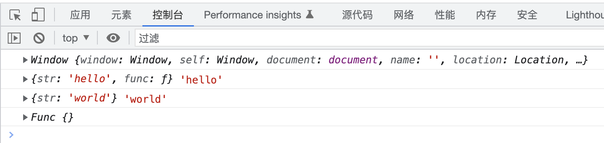
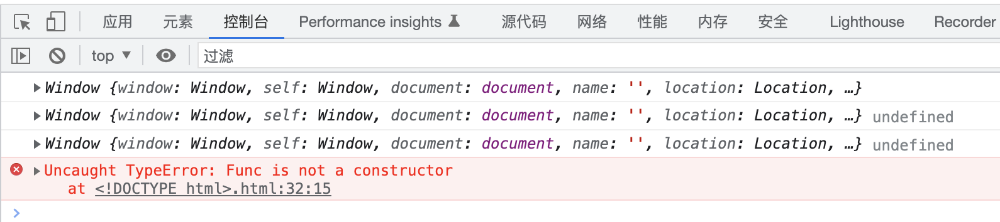

# JS 中的 this

## this 的指向

运行时绑定,谁调用它，this 就指向谁

## 优先级

new 绑定优先级>显示绑定优先级 >隐式绑定优先级>默认绑定优先级

## 绑定规则

- 普通对象 （默认绑定）
- 对象的方法 （隐式绑定）
- call，aplly （显示绑定）
- new 绑定

代码

```javascript
//普通函数中， 指向Window，严格模式下指向undefined
var func = function () {
  console.log(this);
};
func();
//对象的方法中， 指向这个对象
var obj = {
  str: "hello",
  func: function () {
    console.log(this, this.str);
  },
};
obj.func();
//call , apply中， 指向第一个参数
var obj2 = {
  str: "world",
};
obj.func.call(obj2);
//构造函数中，指向要创建的新对象
var Func = function () {
  console.log(this);
};
var f = new Func();
```

输出



## 箭头函数

箭头函数之前的函数中的 this 是运行时绑定的，谁调用就指向谁。

箭头函数固化了 this，在定义时就确定了指向，运行时也不会变化。 会从自己的作用域链的上一层继承 this。

日常编码中，当函数作为参数使用时，会大量的使用箭头函数。

代码

```javascript
//普通函数中， 指向Window，严格模式下指向undefined
var func = () => {
  console.log(this);
};
func();
//对象的方法中， 指向window。。。。。
var obj = {
  str: "hello",
  func: () => {
    console.log(this, this.str);
  },
};
obj.func();
//call , apply中，只能传递参数（不能绑定 this），他们的第一个参数会被忽略。
var obj2 = {
  str: "world",
};
obj.func.call(obj2);
//构造函数中，不能使用箭头函数，会报错 Uncaught TypeError: Func is not a constructor
var Func = () => {
  console.log(this);
};
var f = new Func();
```

输出


